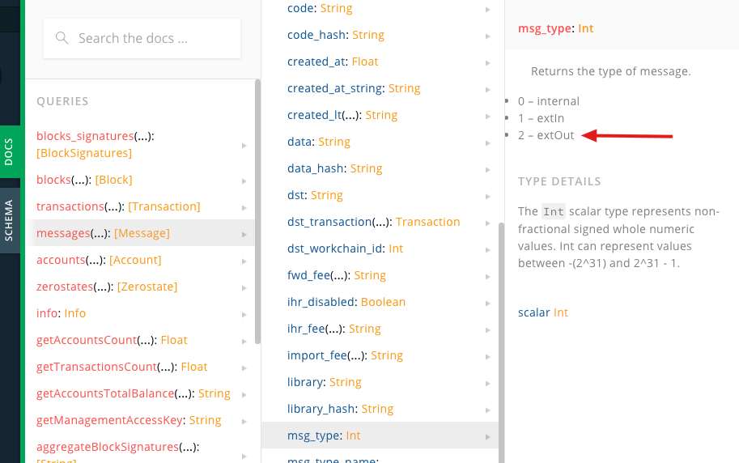

# Work with Events

How to work with contract events

* [About events](work\_with\_events.md#about-events)
* [Query/subscribe to events](work\_with\_events.md#querysubscribe-to-events)
* [Query/Subscribe with SDK](work\_with\_events.md#querysubscribe-with-sdk)
* [AppKit syntax](work\_with\_events.md#appkit-syntax)
  * [Query](work\_with\_events.md#query)
  * [Subscribe](work\_with\_events.md#subscribe)
  * [Decode](work\_with\_events.md#decode)

## About events

When contract emits an event, you can fetch it from blockchain or you can subscribe to it.

Events in blockchain are external outbound messages. In GraphQL API their `msg_type` is 2:



## Query/subscribe to events

You can fetch events of you contract with this filter from graphql. Try it out in playground [main.ton.dev/graphql](https://main.ton.dev/graphql):

```
query{
messages(
      filter:{ 
      src:{
        eq:"-1:67f4bf95722e1bd6df845fca7991e5e7128ce4a6d25f6d4ef027d139a11a7964"
      }
      msg_type:{
        eq:2
      }
    }
)
{
   id
 body
}
}
```

Or subscribe to them:

```
subscription{
messages(
      filter:{ 
      src:{
        eq:"-1:67f4bf95722e1bd6df845fca7991e5e7128ce4a6d25f6d4ef027d139a11a7964"
      }
      msg_type:{
        eq:2
      }
    }
)
{
   id
  body
}
}
```

## Query/Subscribe with SDK

Let's assume our contract code is this:

```
pragma ton-solidity >= 0.38.2;
pragma AbiHeader expire;


contract HelloEvents {
// Event is an external message generated by the contract functions.
// Here we will emit this external outbound message (event)
// every time we have changed the hello text.
event TextUpdated(string text, uint32 time);

// Instance variable storing some user data.
string helloText;

// Instance variable storing the time of `constructor` call or `setHelloText` function call.
uint32 textUpdateTime;

// Constructor sets instance variables.
// All contracts need to call `tvm.accept()` for deploying.
constructor(string text) public {
    tvm.accept();
    helloText = text;
    textUpdateTime = now;
}

// Function `setHelloText` updates instance variables
// `helloText` and `textUpdateTime` 
// and emits `TextUpdated` event.
function setHelloText(string text) external returns (string oldText) {
    require(msg.pubkey() == tvm.pubkey(), 100);
    tvm.accept();
    string saveText = helloText;
    helloText = text;
    textUpdateTime = now;
    emit TextUpdated(helloText, textUpdateTime);
    return saveText;
}

// Function returns value of instance variable `helloText`.
// This function is a get method (it does not change state and has no `accept` function)
// so it can be called only on local TVM.
function getHelloText() public view returns (string text) {
    return helloText;
}

// Function returns value of instance variable `textUpdateTime`.
// This function is a get method (it does not change state and has no `accept` function)
// so it can be called only on local TVM.
function getTextUpdateTime() public view returns (uint32 time) {
    return textUpdateTime;
}
}
```

We see that we have 1 event `TextUpdated(helloText, textUpdateTime)`.

## AppKit syntax

See the full sample here [https://github.com/tonlabs/sdk-samples/tree/master/appkit-examples/listen-and-decode](https://github.com/tonlabs/sdk-samples/tree/master/appkit-examples/listen-and-decode)

### Query

To fetch all the events do this query. It uses low level api, AppKit does not provide query options for account yet.

```
result = (await client.net.query_collection({
        collection: "messages",
        filter: {
            src: {
                eq: "-1:67f4bf95722e1bd6df845fca7991e5e7128ce4a6d25f6d4ef027d139a11a7964",
            },
            msg_type:{ eq:2 }
        },
        result: "boc",
})).result;
```

### Subscribe

To subscribe to new events do this. Don't forget to specify your own callback.

```
await account.subscribeMessages("boc",callback)
```

### Decode

```
const decoded = await hello.decodeMessage(msg.boc);
            switch (decoded.body_type) {
                // Message that triggered an on-chain contract call
            case MessageBodyType.Input:
                if (decoded.name === "setHelloText") {
                    decoded.value.text = decodeText(decoded.value.text);
                }
                console.log(`External inbound message, function "${decoded.name}", parameters: `, JSON.stringify(decoded.value));
                break;
                // External outbound message generated by a function's `return`
            case MessageBodyType.Output:
                if (decoded.name === "setHelloText") {
                    decoded.value.oldText = decodeText(decoded.value.text);
                }
                console.log(`External outbound message, function "${decoded.name}", result`, JSON.stringify(decoded.value));
                break;
                // Event generated by the contract
            case MessageBodyType.Event:
                if (decoded.name === "TextUpdated") {
                    decoded.value.text = decodeText(decoded.value.text);
                }
                console.log(`External outbound message, event "${decoded.name}", parameters`, JSON.stringify(decoded.value));
                break;
            }
```

Check out [core api documentation](https://tonlabs.gitbook.io/ton-sdk/guides/work\_with\_contracts/work\_with\_events) for more information.
